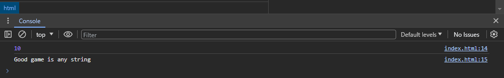

# ЛАБОРАТОРНАЯ РАБОТА №6

### Задание 1

#### КОД:
```HTML
<!DOCTYPE html>
<html lang="ru">
<head>
    <meta charset="UTF-8"/>
    <meta name="viewport" content="width=device-width, initial-scale=1.0"/>
    <title>JS</title>
</head>
<body>
<script>
    let apple = 10;
    let condition = "any string";

    alert(apple);
    console.log(apple);
    console.log('Good game is ' + condition);

</script>
</body>
</html>
```

#### ОТВЕТ В КОНСОЛИ:


#### ОТВЕТЫ НА ВОПРОСЫ
1. Оператор let
2.   const определяет константы, которые нельзя менять после определения.
     var определяет простую, глобальную, внеблочную переменную.
     let переменные имеют блочную видимость, а ещё их нельзя объявить повторно.
3. Alert выводит сообщение в браузере
4. Для дебага

### Задание 2


И ответ в консольке:


### Задание 3


И в консольке:


### Задание 4

Первое:

  

Второе:

  

### Задание 5

Первое:

  

Второе:

!  [img](img/5.2.2.jpg)

На этом все :nail_care:

#### А ВОТ И НЕ ВСЕ

JS это язык настоящих гениев, не каждому дано понять всю суть работы в этом великом языке, да, жаль что не многие нынче понимают как работает JS, мало образованных людей в наше время!!!

